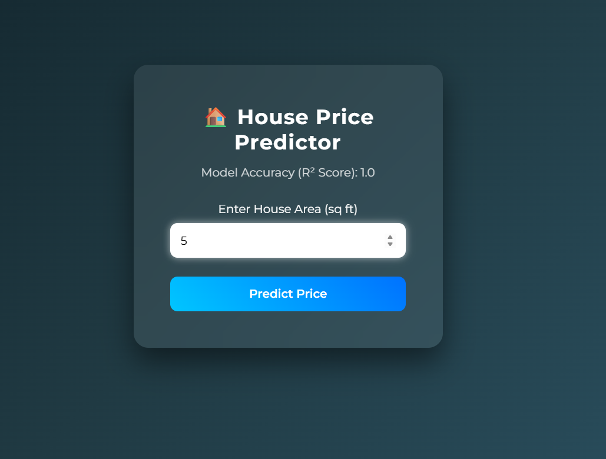
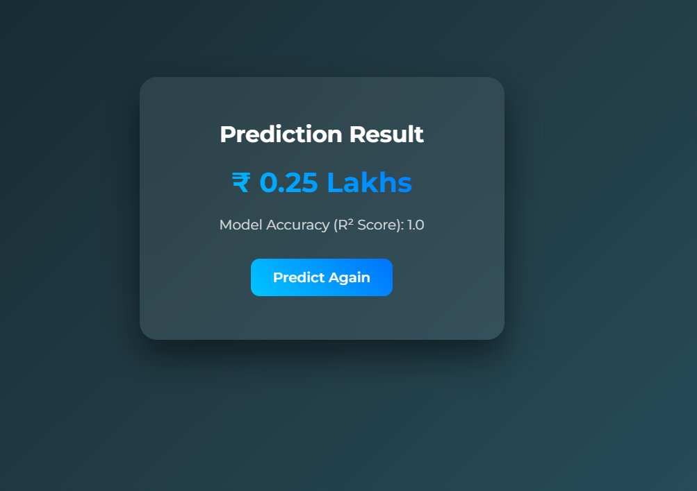

# 🏠 House Price Prediction

## Overview
This project predicts house prices using supervised machine learning (regression). It uses Flask for deployment and provides a simple web interface.

## Features
- Real-time price prediction
- Clean UI using HTML & CSS
- ML model integration
- User input-based prediction

## Tech Stack
- Python
- Flask
- CSS
- HTML

## Machine Learning Model
- Algorithm: Linear Regression
- Type: Supervised Learning
- Output: Predicted house price

## Project Structure
app.py
trained_data.py
templates/index.html,result.html
static/house_data.csv
model.pkl

## How It Works
1. User inputs house details
2. Data sent to backend
3. Model predicts price
4. Result shown on UI

## Installation & Setup
pip install 
python app.py  

## Usage
Open browser → http://127.0.0.1:5000/

## Screenshots

## Results
- Accurate predictions based on dataset
- Fast response via Flask

## Future Improvements
- Add advanced ML models
- Improve UI/UX
- Deploy online

## Learning Outcomes
- Built ML model
- Integrated with Flask
- Created full-stack ML project

## Author
👤 Rajesh Parishapogu
